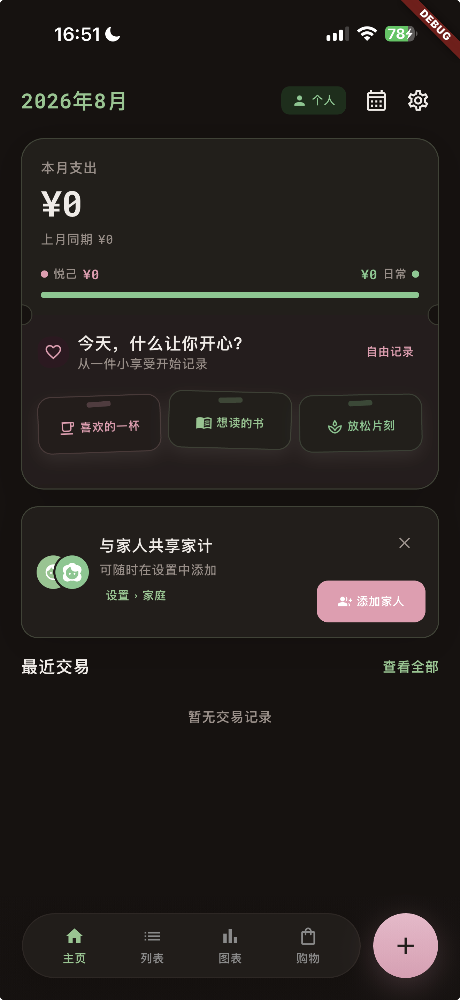

# 初始化设置到首页：性能与过渡体验审计

日期：2026-08-02

## 结论

截图所示流程的主要嫌疑不是网络，而是两个本地关键路径叠加：

1. 点击后串行等待多次偏好设置、安全存储、用户资料数据库/同步 outbox 与头像语义清理。
2. 完成后根节点直接换成 `MainShellScreen`；它通过 `IndexedStack` 首次同时挂载首页、列表、图表和购物清单四棵页面树，触发大量 Provider 与数据库查询。

截图为 Debug 构建。Flutter Debug 模式的额外检查和 JIT 编译会放大首次页面构建的停顿，因此现有截图只能证明体验问题，不能作为 Release 性能数据。精确耗时占比仍需在真机 Profile 模式下埋点采样。

## 流程审计

### 1. 基础设置页 — 需要改进

- 主按钮清晰，且已说明设置之后可以更改。
- 点击后按钮只变成不可用，没有进度图标或“正在准备首页”文案，用户会认为应用冻结。
- 点击时没有主动收起键盘；键盘、设置页和整棵首页树在交接时一起变化，视觉跳变更明显。

### 2. 保存与交接 — 高风险

- 当前没有可见的中间反馈状态。
- `onboarding_settings_screen.dart::_confirm()` 串行等待语言、语音、用户资料和安全设置。
- `onboarding_flow_screen.dart::_complete()` 再等待 `onboarding_complete` 写入。
- 根 gate 最后通过 `setState` 直接替换子树，没有过渡动画。

### 3. 首页 — 页面健康，首帧负担偏重

- 首页信息层级清楚，空状态可理解。
- `MainShellScreen` 的 `IndexedStack` 在首帧构建四个 Tab，而不是只构建当前首页。
- 不可见的列表、图表和购物清单也会订阅 Provider 并启动查询，增加初始化后的第一帧成本。

## 代码证据

| 阶段 | 证据 | 风险 |
| --- | --- | --- |
| 点击反馈 | `_isSaving = true`，但 `_ConfirmButton` 未接收 loading 状态 | 用户看不到系统正在工作 |
| 设置持久化 | 语言、语音、资料、安全设置逐项 `await` | 串行 I/O 拉长等待 |
| 头像维护 | 保存资料后始终进入语义 staging maintenance（即使没有新图片） | 默认头像流程也承担额外查询/文件清理 |
| 完成标记 | 单独等待 `setOnboardingComplete(true)` | 关键路径再增加一次写入 |
| 页面交接 | 根节点 `setState` 后直接返回 `MainShellScreen` | 没有连续性，也没有交接状态 |
| 首页首帧 | `IndexedStack` 直接包含四个完整 Tab | 一次挂载所有页面和 Provider |

## 建议顺序

### P0：先测准

- 在真机 Profile 模式复现全新安装流程。
- 为偏好写入、资料事务、头像清理、安全存储、完成标记、首页首帧分别增加 Timeline 区间。
- 用首帧回调记录“点击 CTA → 首页第一帧呈现”的总耗时。

### P1：降低真实耗时

- 首次只挂载首页；列表、图表和购物清单在第一次点击时创建，并在创建后保持状态。
- 没有头像图片变化时跳过头像 staging/垃圾清理，或把非关键清理放到首页首帧之后。
- 合并或跳过默认值的冗余写入；继续保证 `onboarding_complete` 最后持久化。
- 非首页的预热任务放到首页首帧以后。

### P2：让过渡自然

- 点击立即收起键盘，并将 CTA 切换成进度图标 + 本地化“正在准备首页…”文案。
- 在根 gate 使用 `AnimatedSwitcher`，做约 180–240ms 的淡入与 8–12px 轻微上移；不要使用长距离滑动或逐卡片入场。
- 系统开启 Reduce Motion 时退化为即时切换或极短淡入。
- 动画不能替代加载反馈；若 Profile 模式仍超过约一秒，应保留轻量完成状态而不是拉长动画。

## 常规做法依据

- Flutter 要求性能诊断使用真机 Profile 模式；Debug 模式的额外检查和 JIT 会造成不具代表性的卡顿：<https://docs.flutter.dev/perf/ui-performance>
- Flutter 性能指南建议控制 build/layout 成本并按需构建：<https://docs.flutter.dev/perf/best-practices>
- `RenderIndexedStack` 只绘制选中 child，但布局成本仍是 O(N)：<https://api.flutter.dev/flutter/rendering/RenderIndexedStack-class.html>
- `AnimatedSwitcher` 适合当前这种同一路由中的根子树替换：<https://api.flutter.dev/flutter/widgets/AnimatedSwitcher-class.html>
- Flutter 提供系统“禁用动画”信号：<https://api.flutter.dev/flutter/widgets/MediaQueryData/disableAnimations.html>
- Apple 建议动效简短、有目的且不让用户等待，并支持 Reduced Motion：<https://developer.apple.com/design/human-interface-guidelines/motion>

## 范围与限制

本次为只读代码与截图审计，没有重置设备数据，也没有得到该次点击的 Profile trace。因此“串行本地 I/O + 四 Tab 首帧挂载”为已确认结构性问题；“哪一项占用多少毫秒”仍需真机 Profile 埋点后定量确认。

## 后续实现状态

审计完成后已落实以下改进：

- CTA 点击立即收起键盘，并显示三语“正在准备首页”进度状态。
- 根 gate 使用 220ms 淡入轻移过渡，并遵循系统 Reduce Motion 设置。
- 欢迎页的“跳过”与“开始”进入基础设置时使用 240ms 淡入轻移，返回使用 180ms 对称退出，并遵循 Reduce Motion。
- 首页 Shell 改为 Tab 首次访问时才构建，已访问 Tab 继续保持状态。
- 首页 Shell 忽略 onboarding 键盘退场期间残留的 viewInset，并强制主 Stack 填满视口，避免 Tab/FAB 在首帧被抬高。
- 全新资料没有头像图片时跳过头像 staging 维护。

新增与相关回归测试、`flutter analyze`、完整 `flutter test` 均已通过。真机 Profile 定量采样仍属于后续验证项。
