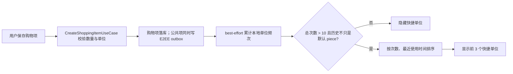

# MOD-010：购物数量与单位

**文档版本：** 1.1  
**日期：** 2026-08-04  
**状态：** 已实现  
**范围：** 新增/编辑购物项、列表显示、家庭同步、本地单位推荐；预留语音解析

## 1. 产品规则

- 新建商品默认数量为 `1`，默认单位为 `piece`；界面显示为日文「個」、中文「件」、英文「pc」。
- 数量和单位分别编辑，切换单位不换算数量。
- 单位按钮固定为 76 px 宽，标签在按钮几何中心显示。
- 内置单位：`piece / gram / kilogram / milliliter / liter / bag / bottle / pack`。
- 自定义单位只从单位选择弹窗进入，长度为 1–12 个字符；表单下方不常驻“自定义”选项。
- 初始不显示快捷单位。
- 只有成功新增商品才累计单位使用次数；编辑、打开弹窗、点击但未保存、同步导入都不累计。
- 累计新增次数 `<= 10` 时不显示快捷单位。从第 11 次成功新增开始，按使用次数降序、最近使用时间降序显示最多 3 个单位。
- 历史中只有默认 `piece` 时不显示快捷单位。因此一直使用「件」的用户不会看到无意义的推荐；若唯一历史单位是非默认单位，则第 11 次后仍可显示该单位。
- 快捷单位只替换单位，不修改数量。

## 2. 数据模型

### 2.1 `shopping_items`

| 字段 | 类型 | 默认值 | 说明 |
|---|---|---|---|
| `quantity` | `REAL NOT NULL` | `1.0` | 大于 0，支持 `1.5 kg`、`0.25 L` |
| `unit_id` | `TEXT NOT NULL` | `piece` | 稳定枚举 ID，不存本地化文案 |
| `custom_unit` | `TEXT NULL` | `NULL` | 仅 `unit_id=custom` 时使用 |

领域层使用 `ShoppingUnit` 与 `ShoppingUnitSelection`。Repository 负责枚举 ID 与 Drift 字段之间的转换；非自定义单位写库时强制清空 `custom_unit`。

本功能在正式上线前完成，按产品决定不提供旧 schema 迁移。当前 schema 版本保持不变，开发阶段已有数据库需要重新安装或清空后使用 fresh schema。禁止在代码中自动破坏现有开发数据。

### 2.2 `shopping_unit_usages`

本地 SQLCipher 数据库保存聚合后的使用频次：

| 字段 | 说明 |
|---|---|
| `usage_key` | 主键；内置单位为枚举 ID，自定义单位为规范化后的 `custom:<label>` |
| `unit_id` | 内置 ID 或 `custom` |
| `custom_unit` | 自定义显示文本 |
| `use_count` | 成功新增次数 |
| `last_used_at` | 最近成功新增时间，用于同频次排序 |

该表是 local-only 用户偏好数据：

- 加入 `AppDatabase.localUserDataTableNames` 和全部数据清除顺序。
- 不进入 family sync outbox，不上传自定义单位历史。
- 使用事务执行“查询后新增/加一”，避免计数丢失。

## 3. 写入与推荐流程



频次写入是 best-effort：购物项已经成功提交后，偏好写入失败不能让用户看到“保存失败”。错误日志不得包含自定义单位文本。

## 4. 同步协议

公共购物项的 E2EE payload 增加：

```json
{
  "quantity": 200.0,
  "unitId": "gram",
  "customUnit": null
}
```

- `sortOrder`、`isSynced` 等本地字段仍不发送。
- delete tombstone 不需要数量与单位。
- 接收端用 `num.toDouble()` 解码数量，用稳定 ID 解码单位；非法或未知 ID安全回退为 `piece`。
- 入站同步只更新购物项，不写 `shopping_unit_usages`，避免其他家庭成员的习惯改变本机推荐。
- 本轮不实现旧客户端双写或协议迁移。

## 5. 表单与列表

表单采用 v16 方案 3：一个居中的十进制数量输入框和一个窄单位按钮。单位弹窗列出 8 个内置单位与“自定义单位”；选择自定义后才出现文本框。

列表始终组合显示数量与单位：

- SI 单位留空格：`200 g`、`1.5 kg`、`500 ml`。
- 日中计数单位紧排：`2個`、`3袋`、`2件`、`1瓶`。
- 英文统一留空格：`2 pc`、`3 bag`。
- 分类存在时显示为 `分类 · 数量单位`。
- 数量格式最多显示 3 位小数，并移除末尾无意义的 0。

## 6. 预留语音解析（MVP 不开放入口）

MVP 的新增与编辑购物项页面均不展示语音入口，也不会初始化麦克风或开始识别。现有解析器和草稿组件作为后续能力保留，但生产表单通过发布门禁保持关闭。

语音草稿同时返回 `quantity` 与 `unit`：

- `砂糖 200g` → `200 + gram`
- `牛乳を2本` → `2 + bottle`
- `两袋米` → `2 + bag`
- `two packs of tissues` → `2 + pack`

语音只填充草稿，不自动保存；明确识别到单位时更新单位，否则保留当前单位。

## 7. 质量门槛

- 推荐阈值测试：10 次隐藏；11 次但仅默认 `piece` 隐藏；11 次仅非默认单位显示 1 个；多单位显示 Top 3。
- DAO 测试：重复单位计数累加，自定义标签保留。
- Use case 测试：成功新增只记录一次，编辑和同步不记录。
- Widget 测试：默认件、初始无提示、单位居中且 76 px、自定义弹窗、快捷单位不改数量。
- Sync/Repository 测试：小数与单位往返。
- List 测试：日中/英文数量单位格式。
- 交付前运行 `flutter analyze`、相关单元/Widget 测试与视觉对照。
