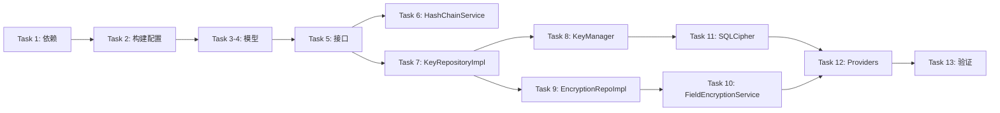

# 加密基础设施开发计划可行性报告

**报告日期:** 2026-02-06
**分析人:** Flutter 专业开发人员
**分析对象:** `docs/plans/2026-02-06-crypto-infrastructure.md`
**参考文档:** ARCH-001, ARCH-003, BASIC-001, ADR-003, ADR-006, ADR-009

---

## 1. 执行摘要

| 项目 | 评估 |
|------|------|
| **整体可行性** | ✅ **高度可行** |
| **技术成熟度** | ✅ 所选技术栈成熟稳定 |
| **架构一致性** | ✅ 与现有架构文档高度一致 |
| **工作量估算** | ⚠️ 偏乐观（建议 4-6 小时） |
| **风险等级** | 🟢 低风险 |

**核心结论:** 该开发计划设计合理、技术选型正确、实现路径清晰。建议采纳并实施，同时关注本报告中提出的改进建议。

---

## 2. 计划概述

### 2.1 目标功能

构建完整的加密基础设施层（`lib/infrastructure/crypto/`），提供：

| 功能 | 技术 | 架构位置 |
|------|------|----------|
| Ed25519 密钥管理 | `cryptography` | services/key_manager.dart |
| ChaCha20-Poly1305 字段加密 | `cryptography` | services/field_encryption_service.dart |
| SHA-256 哈希链完整性 | `crypto` | services/hash_chain_service.dart |
| SQLCipher 数据库加密 | `sqlcipher_flutter_libs` | database/encrypted_database.dart |

### 2.2 任务分解（13 个任务）

| Task | 内容 | 预估复杂度 |
|------|------|-----------|
| 1 | 添加 pubspec.yaml 依赖 | 简单 |
| 2 | 配置 build.yaml 和 analysis_options | 简单 |
| 3 | DeviceKeyPair Freezed 模型 | 简单 |
| 4 | ChainVerificationResult 模型 | 简单 |
| 5 | Repository 接口 + 自定义异常 | 简单 |
| 6 | HashChainService (TDD) | 中等 |
| 7 | KeyRepositoryImpl (TDD) | 中等 |
| 8 | KeyManager (TDD) | 简单 |
| 9 | EncryptionRepositoryImpl (TDD) | 中等 |
| 10 | FieldEncryptionService (TDD) | 简单 |
| 11 | SQLCipher 加密数据库配置 | 中等 |
| 12 | Riverpod Providers 配置 | 简单 |
| 13 | 全量测试 + 静态分析 | 简单 |

---

## 3. 可行性分析

### 3.1 技术可行性 ✅

#### 依赖包评估

| 依赖 | 版本 | Pub 评分 | 成熟度 | 评估 |
|------|------|---------|--------|------|
| `cryptography` | ^2.7.0 | 高 | 生产就绪 | ✅ |
| `crypto` | ^3.0.6 | 高 | 生产就绪 | ✅ |
| `flutter_secure_storage` | ^9.2.4 | 高 | 生产就绪 | ✅ |
| `sqlcipher_flutter_libs` | ^0.6.7 | 中 | 稳定 | ✅ |
| `drift` | ^2.25.0 | 高 | 生产就绪 | ✅ |
| `freezed` | ^3.0.0 | 高 | 生产就绪 | ✅ |
| `riverpod` | ^2.6.1 | 高 | 生产就绪 | ✅ |
| `mocktail` | ^1.0.4 | 高 | 生产就绪 | ✅ |

**结论:** 所有依赖包均为 Flutter 社区广泛采用的成熟库，无兼容性风险。

#### 算法选型评估

| 算法 | 用途 | 安全强度 | 性能 | 评估 |
|------|------|---------|------|------|
| Ed25519 | 数字签名 | 128-bit | 快速 | ✅ 行业标准 |
| ChaCha20-Poly1305 | 字段 AEAD 加密 | 256-bit | 移动端优化 | ✅ 最佳选择 |
| SHA-256 | 哈希链 | 256-bit | 快速 | ✅ 行业标准 |
| AES-256-CBC + PBKDF2 | SQLCipher | 256-bit | 稳定 | ✅ 行业标准 |
| HKDF-SHA256 | 密钥派生 | 256-bit | 快速 | ✅ RFC 5869 |

### 3.2 架构一致性 ✅

计划目录结构与 ARCH-001 / ARCH-008 层次标准完全一致：

```
✅ lib/infrastructure/crypto/         ← 正确位置（全局 Infrastructure 层）
   ├── services/                       ← 服务层
   ├── models/                         ← 唯一模型定义
   ├── repositories/                   ← 接口 + 实现
   └── database/                       ← 数据库配置
```

**架构合规性检查:**

| 规则 | 状态 | 说明 |
|------|------|------|
| Infrastructure 在全局层 | ✅ | 未放入 features/ 目录 |
| Repository 模式 | ✅ | 接口与实现分离 |
| 模型唯一定义 | ✅ | DeviceKeyPair、ChainVerificationResult |
| Riverpod 代码生成 | ✅ | 使用 @riverpod 注解 |
| Freezed 不可变模型 | ✅ | 使用 @freezed 注解 |

### 3.3 安全合规性 ✅

计划与 ARCH-003 安全架构设计一致：

| 安全要求 | 计划实现 | 状态 |
|----------|----------|------|
| 多层加密 (Layer 1-2) | SQLCipher + ChaCha20 | ✅ |
| 密钥存储安全 | iOS Keychain / Android Keystore | ✅ |
| 哈希链完整性 | SHA-256 链式哈希 | ✅ |
| 数字签名 | Ed25519 | ✅ |
| HKDF 密钥派生 | 固定 Salt + 上下文 Info | ✅ |

### 3.4 测试策略 ✅

计划采用 TDD 方法，测试覆盖全面：

| 组件 | 测试用例数 | 测试类型 |
|------|-----------|---------|
| DeviceKeyPair | 4 | 单元测试 |
| ChainVerificationResult | 5 | 单元测试 |
| HashChainService | 11 | 单元测试 |
| KeyRepositoryImpl | 9 | 单元测试 (Mock) |
| KeyManager | 7 | 单元测试 (Mock) |
| EncryptionRepositoryImpl | 10 | 单元测试 (Mock) |
| FieldEncryptionService | 5 | 单元测试 (Mock) |
| **总计** | **~51** | — |

---

## 4. 待改进点

### 4.1 🔴 高优先级

#### 4.1.1 数据库密钥派生问题

**问题:** Task 11 中的 `_deriveDatabaseKey` 使用简化算法：

```dart
// 当前实现（MVP 简化版）
for (int i = 0; i < 32; i++) {
  keyBytes.add(publicKeyBytes[i % publicKeyBytes.length]);
}
```

**风险:** 这不是密码学安全的密钥派生，存在熵损失。

**建议:**
```dart
// 推荐：使用 HKDF 统一派生
final dbKey = await hkdf.deriveKey(
  secretKey: SecretKey(masterKeyBytes),
  info: utf8.encode('database_encryption'),
  nonce: utf8.encode('homepocket-v1-2026'),
);
```

#### 4.1.2 缺少 Master Key 管理

**问题:** 计划使用公钥派生加密密钥，但架构文档（ARCH-003 §3.1）明确要求使用独立的 Master Key：

> "主密钥（Master Key）- 256-bit 强随机密钥，存储位置：iOS Keychain / Android KeyStore"

**建议:** 增加 Task 1.5：实现 Master Key 生成与存储逻辑，所有派生密钥均从 Master Key 派生。

#### 4.1.3 Provider 类型注解过时

**问题:** Task 12 中使用的 Riverpod 2.x Provider Ref 类型即将废弃：

```dart
// 计划中的写法（已弃用警告）
KeyRepository keyRepository(KeyRepositoryRef ref) { ... }

// Riverpod 3.0 推荐写法
KeyRepository keyRepository(Ref ref) { ... }
```

**建议:** 直接使用 `Ref` 类型以避免未来迁移成本。

### 4.2 🟡 中优先级

#### 4.2.1 工作量估算偏乐观

**问题:** 计划估算 "2-3 小时"，但考虑以下因素：

- TDD 红-绿-重构周期
- 代码生成等待时间
- SQLCipher 平台配置调试
- 首次 Freezed/Riverpod 项目配置

**建议:** 调整估算为 **4-6 小时**（含调试时间）。

#### 4.2.2 缺少集成测试

**问题:** 计划仅包含单元测试，缺少：

- SQLCipher 真实加密/解密集成测试
- Flutter 平台通道（Secure Storage）集成测试
- 端到端加密流程测试

**建议:** 增加 Task 13.5：
```yaml
# 集成测试（需要真实设备/模拟器）
integration_test/
  └── crypto_integration_test.dart
    - 测试真实 SQLCipher 加密
    - 测试 Keychain/Keystore 存储
    - 测试完整密钥生成→加密→解密流程
```

#### 4.2.3 错误处理不完整

**问题:** 部分异常场景未覆盖：

| 场景 | 当前处理 | 建议 |
|------|---------|------|
| Secure Storage 不可用 | 未处理 | 抛出 `SecureStorageUnavailableException` |
| SQLCipher 初始化失败 | 抛出 StateError | 定义 `DatabaseEncryptionException` |
| HKDF 派生失败 | 未处理 | 定义 `KeyDerivationException` |

#### 4.2.4 日志审计缺失

**问题:** 安全敏感操作应记录审计日志：

- 密钥生成时间
- 密钥恢复事件
- 加密/解密失败事件

**建议:** 增加 `AuditLogger` 调用（不记录敏感数据内容）。

### 4.3 🟢 低优先级

#### 4.3.1 文档内联过长

**问题:** 计划文档 2227 行，包含大量完整代码，可读性受影响。

**建议:** 将测试代码移至独立附录或直接参考测试文件路径。

#### 4.3.2 缺少平台版本兼容性说明

**问题:** SQLCipher 和 flutter_secure_storage 在低版本 Android/iOS 上可能有限制。

**建议:** 添加平台兼容性矩阵：

| 平台 | 最低版本 | 说明 |
|------|---------|------|
| iOS | 14.0+ | Keychain 需要 |
| Android | API 24+ (7.0) | Keystore 需要 |

#### 4.3.3 缺少性能基准测试

**建议:** 增加性能测试用例：
- 字段加密延迟 < 10ms
- 哈希计算延迟 < 1ms
- 批量加密吞吐量

---

## 5. 风险评估

| 风险 | 概率 | 影响 | 缓解措施 |
|------|------|------|---------|
| SQLCipher 原生库加载失败 | 低 | 高 | 添加降级处理和用户提示 |
| Keychain/Keystore 访问被拒 | 低 | 高 | 实现 fallback 机制 |
| Flutter 版本升级破坏兼容性 | 中 | 中 | 锁定依赖版本，定期更新 |
| 加密性能影响用户体验 | 低 | 中 | 实现密钥缓存机制 |

---

## 6. 建议实施顺序

基于依赖关系和风险，建议按以下顺序实施：



---

## 7. 结论与建议

### 7.1 总体评价

| 维度 | 评分 (1-5) | 说明 |
|------|-----------|------|
| **技术设计** | ⭐⭐⭐⭐⭐ | 算法选型正确，架构清晰 |
| **代码质量** | ⭐⭐⭐⭐⭐ | TDD 方法，测试覆盖全面 |
| **安全性** | ⭐⭐⭐⭐ | 基本安全，需补充 Master Key |
| **可维护性** | ⭐⭐⭐⭐⭐ | Repository 模式，依赖注入 |
| **文档完整性** | ⭐⭐⭐⭐ | 详尽但略显冗长 |

### 7.2 实施建议

1. **立即采纳** - 计划整体可行，可直接开始实施
2. **优先修复** - 实施前先修正数据库密钥派生算法（§4.1.1）
3. **同步进行** - 添加 Master Key 管理逻辑（§4.1.2）
4. **后续迭代** - 其他改进点可在后续版本中完善

### 7.3 最终建议

> ✅ **建议采纳该计划并实施**
>
> 该计划设计合理、技术选型正确，与架构文档高度一致。建议在实施过程中关注本报告中的改进建议，特别是高优先级的密钥派生问题。

---

## 附录 A: 参考文档清单

| 文档 | 路径 |
|------|------|
| 开发计划 | `docs/plans/2026-02-06-crypto-infrastructure.md` |
| 完整架构指南 | `docs/arch/01-core-architecture/ARCH-001_Complete_Guide.md` |
| 安全架构 | `docs/arch/01-core-architecture/ARCH-003_Security_Architecture.md` |
| 加密基础设施规格 | `docs/arch/04-basic/BASIC-001_Crypto_Infrastructure.md` |
| 多层加密决策 | `docs/arch/03-adr/ADR-003_Multi_Layer_Encryption.md` |
| 密钥派生决策 | `docs/arch/03-adr/ADR-006_Key_Derivation_Security.md` |
| 增量哈希验证 | `docs/arch/03-adr/ADR-009_Incremental_Hash_Chain_Verification.md` |

## 附录 B: 改进建议优先级矩阵

| 编号 | 改进点 | 优先级 | 工作量 | 建议时机 |
|------|--------|--------|--------|---------|
| 4.1.1 | 数据库密钥派生 | 🔴 高 | 0.5h | 实施前 |
| 4.1.2 | Master Key 管理 | 🔴 高 | 1h | 实施前 |
| 4.1.3 | Provider Ref 类型 | 🔴 高 | 0.25h | 实施中 |
| 4.2.1 | 工作量估算 | 🟡 中 | - | 已知晓 |
| 4.2.2 | 集成测试 | 🟡 中 | 2h | 实施后 |
| 4.2.3 | 错误处理 | 🟡 中 | 0.5h | 实施中 |
| 4.2.4 | 日志审计 | 🟡 中 | 0.5h | 实施后 |
| 4.3.1 | 文档精简 | 🟢 低 | 0.5h | 可选 |
| 4.3.2 | 平台兼容性 | 🟢 低 | 0.25h | 可选 |
| 4.3.3 | 性能基准 | 🟢 低 | 1h | 可选 |
