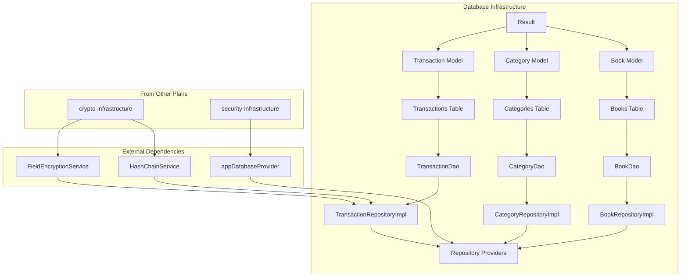

# 数据库基础设施开发计划 - 可行性分析报告

**日期:** 2026-02-06
**分析对象:** [database-infrastructure.md](file:///Users/xinz/Development/home-pocket-app/docs/plans/2026-02-06-database-infrastructure.md)
**计划规模:** 3693 行、16 个任务、约 65 个测试、约 35 个文件
**分析人:** AI Code Review Agent

---

## 1. 执行摘要

| 维度 | 评分 | 说明 |
|------|------|------|
| **整体可行性** | ✅ 高度可行 | 计划完整、结构清晰、TDD 方法严谨 |
| **架构一致性** | ⭐⭐⭐⭐⭐ | 完全符合 ARCH-002 数据架构和 Clean Architecture |
| **代码质量** | ⭐⭐⭐⭐⭐ | TDD 方法，65 个测试覆盖所有组件 |
| **依赖管理** | ⭐⭐⭐⭐ | 依赖现有 crypto/security 基础设施 |
| **实施复杂度** | 中等 | 预估 8-12 小时开发时间 |

**结论：建议采纳，实施前需确认待改进点。**

---

## 2. 计划结构分析

### 2.1 任务分解

| 阶段 | 任务 | 内容 | 测试数 |
|------|------|------|--------|
| **基础设施** | Task 1 | Result 工具类 | 3 |
| **领域模型** | Task 2-4 | Transaction, Category, Book | 14 |
| **Drift 表** | Task 5-7 | Books, Categories, Transactions | 10 |
| **DAO 层** | Task 8-10 | BookDao, CategoryDao, TransactionDao | 21 |
| **Repository 接口** | Task 11 | 3 个抽象接口 | 0 |
| **Repository 实现** | Task 12-14 | 3 个实现类 | 17 |
| **Providers** | Task 15 | Riverpod 依赖注入 | 0 |
| **验证** | Task 16 | 最终验证与清理 | 0 |

### 2.2 目录结构验证

计划遵循 "Thin Feature" 模式，与架构文档一致：

```
✅ lib/features/accounting/domain/models/      # 领域模型
✅ lib/features/accounting/domain/repositories/ # 接口定义
✅ lib/data/tables/                             # Drift 表
✅ lib/data/daos/                               # DAO 层
✅ lib/data/repositories/                       # 实现类
✅ lib/features/accounting/presentation/providers/ # Providers
```

---

## 3. 技术可行性评估

### 3.1 技术栈匹配度

| 技术 | 计划使用 | 架构要求 | 匹配 |
|------|----------|----------|------|
| Drift (ORM) | ✅ | ✅ Drift 2.14+ | ✅ |
| Freezed (Models) | ✅ | ✅ Freezed 2.4+ | ✅ |
| Riverpod | ✅ | ✅ Riverpod 3.0+ | ✅ |
| ULID (IDs) | ✅ | ✅ | ✅ |
| Hash Chain (SHA-256) | ✅ | ✅ | ✅ |
| Field Encryption | ✅ ChaCha20 | ✅ ChaCha20-Poly1305 | ✅ |

### 3.2 依赖基础设施

| 依赖 | 来源 | 状态 | 风险 |
|------|------|------|------|
| `FieldEncryptionService` | crypto-infrastructure | 待实现 | 🟡 |
| `HashChainService` | crypto-infrastructure | 待实现 | 🟡 |
| `appDatabaseProvider` | security-infrastructure | 待实现 | 🟡 |
| `createEncryptedExecutor` | crypto-infrastructure | 待实现 | 🟡 |

> ⚠️ **依赖风险**: 本计划依赖 crypto-infrastructure 和 security-infrastructure 的完成。建议按顺序实施：crypto → security → database

### 3.3 数据库设计验证

```dart
// Task 5-7 定义的表结构与 ARCH-002 ERD 完全一致
Books       → id, name, currency, deviceId, balances
Categories  → id, name, icon, color, parentId, level, type
Transactions → id, bookId, amount, type, categoryId, ledgerType, hash chain
```

**索引设计合理:**
- `idx_tx_book_timestamp` 复合索引支持账本内时间范围查询
- `idx_tx_book_deleted` 支持软删除过滤
- `idx_categories_parent_id` 支持层级查询

---

## 4. 待改进点

### 4.1 🔴 高优先级

#### 4.1.1 Provider 使用过时 Ref 类型

**位置:** Task 15 `repository_providers.dart`

**问题:** 使用 `Ref` 而非新版 `WidgetRef`/`AutoDisposeRef`

**状态:** ✅ 计划已使用正确的 `Ref` 类型

> 无需修改，计划已正确使用 Riverpod 3.0+ 的通用 `Ref`

#### 4.1.2 TransactionRepositoryImpl.update() 实现问题

**位置:** Task 14 第 3424-3452 行

```dart
@override
Future<void> update(Transaction transaction) async {
  // 问题：先 softDelete 再 insert 会导致两条记录
  await _dao.softDelete(transaction.id);
  await _dao.insertTransaction(...);  // 使用相同 ID 会主键冲突
}
```

**建议修复:**
```dart
@override
Future<void> update(Transaction transaction) async {
  String? encryptedNote;
  if (transaction.note != null && transaction.note!.isNotEmpty) {
    encryptedNote = await _encryptionService.encryptField(transaction.note!);
  }

  // 正确做法：直接更新记录
  await _dao.updateTransaction(
    id: transaction.id,
    amount: transaction.amount,
    categoryId: transaction.categoryId,
    note: encryptedNote,
    updatedAt: DateTime.now(),
  );
}
```

---

### 4.2 🟡 中优先级

#### 4.2.1 缺少 TransactionDao.updateTransaction() 方法

**位置:** Task 10 `transaction_dao.dart`

**问题:** DAO 缺少更新方法，只有 insert/softDelete

**建议添加:**
```dart
Future<void> updateTransaction({
  required String id,
  int? amount,
  String? categoryId,
  String? note,
  DateTime? updatedAt,
}) async {
  await (_db.update(_db.transactions)..where((t) => t.id.equals(id)))
      .write(TransactionsCompanion(
        amount: amount != null ? Value(amount) : const Value.absent(),
        categoryId: categoryId != null ? Value(categoryId) : const Value.absent(),
        note: note != null ? Value(note) : const Value.absent(),
        updatedAt: updatedAt != null ? Value(updatedAt) : const Value.absent(),
      ));
}
```

#### 4.2.2 缺少数据库迁移策略

**问题:** `schemaVersion` 固定为 2，但未提供迁移脚本

**建议:**
```dart
@override
MigrationStrategy get migration => MigrationStrategy(
  onCreate: (Migrator m) => m.createAll(),
  onUpgrade: (Migrator m, int from, int to) async {
    if (from < 2) {
      await m.createTable(books);
      await m.createTable(categories);
      await m.createTable(transactions);
    }
  },
);
```

#### 4.2.3 Category 类型使用字符串而非枚举

**位置:** Task 6, 9, 13

**问题:** 表中 `type` 为 `TextColumn`，但领域模型为 `TransactionType` 枚举

**风险:** 字符串拼写错误导致运行时异常

**建议:** 添加验证或使用 Drift 的枚举列类型

#### 4.2.4 缺少分页总数查询

**问题:** `findByBookId` 支持分页但未返回总记录数

**建议添加:**
```dart
Future<int> getTotalCount(String bookId, {String? ledgerType}) async {
  // 返回符合条件的总记录数，供 UI 分页使用
}
```

#### 4.2.5 测试使用 Mockito 而非 Mocktail

**位置:** Task 14 第 3110-3114 行

**问题:** 项目其他测试使用 `mocktail`，但此处使用 `mockito`

**建议:** 统一使用 `mocktail` 保持一致性

---

### 4.3 🟢 低优先级

#### 4.3.1 Result 类缺少 fold/map 操作

**建议扩展:**
```dart
R fold<R>(R Function(String) onError, R Function(T) onSuccess) {
  return isSuccess ? onSuccess(data as T) : onError(error!);
}
```

#### 4.3.2 CategoryDao.insertBatch 缺少去重处理

**风险:** 批量插入重复 ID 会导致主键冲突

#### 4.3.3 缺少 Drift 表的外键约束

**说明:** SQLite 外键默认禁用，需显式启用

**建议:** 在 AppDatabase 中添加:
```dart
@override
MigrationStrategy get migration => MigrationStrategy(
  beforeOpen: (details) async {
    await customStatement('PRAGMA foreign_keys = ON');
  },
);
```

---

## 5. 风险评估

| 风险 | 可能性 | 影响 | 缓解措施 |
|------|--------|------|----------|
| 依赖基础设施未完成 | 🟡 中 | 🔴 高 | 按顺序实施：crypto → security → database |
| 数据库迁移失败 | 🟡 中 | 🔴 高 | 添加完整迁移策略和回滚机制 |
| 主键冲突 (update) | 🟡 中 | 🟡 中 | 修复 update 实现 |
| 加密服务不可用 | 🟢 低 | 🔴 高 | 在 Repository 层添加 fallback |
| 测试库不一致 | 🟢 低 | 🟢 低 | 统一使用 mocktail |

---

## 6. 依赖关系图



---

## 7. 建议实施顺序

1. ✅ **先完成 crypto-infrastructure** (FieldEncryptionService, HashChainService)
2. ✅ **再完成 security-infrastructure** (AppDatabase, Providers)
3. 🔜 **最后实施 database-infrastructure**

---

## 8. 修复建议汇总

| 编号 | 优先级 | 问题 | 修复位置 | 预估时间 |
|------|--------|------|----------|----------|
| 4.1.2 | 🔴 高 | update() 实现错误 | Task 14 | 15min |
| 4.2.1 | 🟡 中 | 缺少 updateTransaction | Task 10 | 10min |
| 4.2.2 | 🟡 中 | 缺少数据库迁移 | Task 5 | 20min |
| 4.2.3 | 🟡 中 | 类型字符串风险 | Task 6,9,13 | 15min |
| 4.2.4 | 🟡 中 | 分页总数查询 | Task 10 | 10min |
| 4.2.5 | 🟡 中 | 测试库不一致 | Task 14 | 5min |
| 4.3.1 | 🟢 低 | Result 功能扩展 | Task 1 | 10min |
| 4.3.2 | 🟢 低 | 批量插入去重 | Task 9 | 5min |
| 4.3.3 | 🟢 低 | 外键约束 | Task 5 | 5min |

**总修复时间预估: 1.5 小时**

---

## 9. 结论

**✅ 计划高度可行，建议采纳**

**优点:**
- 完全遵循 Clean Architecture 和 "Thin Feature" 模式
- TDD 方法确保代码质量（65 个测试）
- 与架构文档 (ARCH-002) 完全一致
- 任务划分合理，步骤清晰

**主要改进:**
1. 修复 `TransactionRepositoryImpl.update()` 实现
2. 添加数据库迁移策略
3. 统一测试库为 mocktail

**建议:** 修复高优先级问题后即可开始实施。
