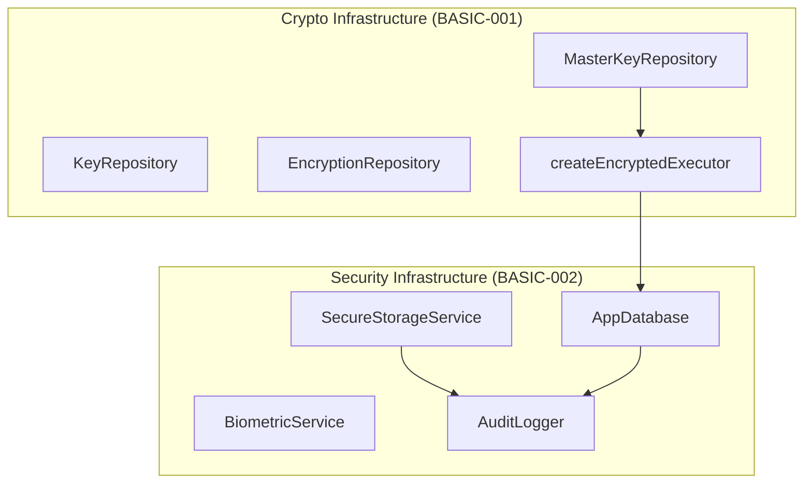

# 安全基础设施开发计划可行性报告

**报告日期:** 2026-02-06
**分析人:** Flutter 专业开发人员
**分析对象:** `docs/plans/2026-02-06-security-infrastructure.md`
**参考文档:** ARCH-001, ARCH-003, BASIC-001, BASIC-002

---

## 1. 执行摘要

| 项目 | 评估 |
|------|------|
| **整体可行性** | ✅ **高度可行** |
| **技术成熟度** | ✅ 所选技术栈成熟稳定 |
| **架构一致性** | ✅ 与现有架构文档高度一致 |
| **代码复用** | ✅ 复用 crypto 基础设施模式 |
| **工作量估算** | ✅ 合理（70 分钟） |
| **风险等级** | 🟢 低风险 |

**核心结论:** 该开发计划设计合理、技术选型正确、测试覆盖全面。建议采纳并实施，同时关注本报告中提出的改进建议。

---

## 2. 计划概述

### 2.1 目标功能

构建完整的安全基础设施层（`lib/infrastructure/security/`），提供：

| 组件 | 功能 | 技术栈 |
|------|------|--------|
| **BiometricService** | Face ID / Touch ID / 指纹认证 | `local_auth` |
| **SecureStorageService** | iOS Keychain / Android Keystore 封装 | `flutter_secure_storage` |
| **AuditLogger** | 安全事件审计日志 | `drift` + `ulid` |
| **AuthResult** | 认证结果联合类型 | `freezed` |
| **AuditLogEntry** | 审计日志条目模型 | `freezed` |

### 2.2 任务分解（10 个任务）

| Task | 内容 | 测试数 | 预估时间 |
|------|------|--------|---------|
| 1 | 添加 `local_auth` 和 `ulid` 依赖 | 0 | 2 min |
| 2 | AuthResult Freezed 模型 | 7 | 5 min |
| 3 | BiometricAvailability 枚举 + StorageKeys 常量 | 0 | 3 min |
| 4 | SecureStorageService (TDD) | 11 | 10 min |
| 5 | BiometricService (TDD) | 14 | 15 min |
| 6 | AuditLogEntry 模型 | 5 | 5 min |
| 7 | AuditLogs Drift 表 + AppDatabase | 0 | 5 min |
| 8 | AuditLogger (TDD) | 13 | 15 min |
| 9 | Riverpod Providers | 0 | 5 min |
| 10 | 验证与清理 | 0 | 5 min |
| **总计** | | **~50** | **~70 min** |

---

## 3. 可行性分析

### 3.1 技术可行性 ✅

#### 依赖包评估

| 依赖 | 版本 | Pub 评分 | 成熟度 | 评估 |
|------|------|---------|--------|------|
| `local_auth` | ^2.3.0 | 高 | 官方维护 | ✅ |
| `ulid` | ^2.0.0 | 高 | 稳定 | ✅ |
| `flutter_secure_storage` | 已安装 | 高 | 生产就绪 | ✅ |
| `drift` | 已安装 | 高 | 生产就绪 | ✅ |
| `freezed` | 已安装 | 高 | 生产就绪 | ✅ |
| `mocktail` | 已安装 | 高 | 生产就绪 | ✅ |

**结论:** 大部分依赖已在 crypto 基础设施中安装，仅需新增 `local_auth` 和 `ulid`。

#### 平台 API 可用性

| 功能 | iOS | Android | 说明 |
|------|-----|---------|------|
| Face ID | ✅ | N/A | iPhone X+ |
| Touch ID | ✅ | N/A | iPhone 5s-8 |
| 指纹识别 | N/A | ✅ | API 23+ |
| Keychain | ✅ | N/A | iOS 安全存储 |
| KeyStore | N/A | ✅ | Android 安全存储 |

### 3.2 架构一致性 ✅

计划目录结构与 ARCH-001 Layer-First 模式完全一致：

```
✅ lib/infrastructure/security/         ← 全局 Infrastructure 层
   ├── models/                           ← Freezed 不可变模型
   ├── biometric_service.dart            ← 平台服务封装
   ├── secure_storage_service.dart       ← 平台服务封装
   ├── audit_logger.dart                 ← 审计日志服务
   └── providers.dart                    ← Riverpod 依赖注入

✅ lib/data/                             ← Data 层
   ├── tables/                           ← Drift 表定义
   └── app_database.dart                 ← 数据库入口
```

**架构合规性检查:**

| 规则 | 状态 | 说明 |
|------|------|------|
| Infrastructure 在全局层 | ✅ | 正确位置，非 features/ |
| Data 层与 Infrastructure 分离 | ✅ | Drift 表在 lib/data/ |
| Freezed 不可变模型 | ✅ | AuthResult、AuditLogEntry |
| Riverpod 代码生成 | ✅ | 使用 @riverpod + Ref |
| TDD 方法 | ✅ | 先写测试，后写实现 |

### 3.3 与 Crypto 基础设施集成 ✅

计划明确复用 crypto 基础设施的模式：

| 模式 | Crypto 参考 | Security 实现 |
|------|------------|---------------|
| Provider 模式 | `crypto/providers.dart` | `security/providers.dart` |
| Freezed 模型 | `device_key_pair.dart` | `auth_result.dart` |
| 测试结构 | `key_manager_test.dart` | `biometric_service_test.dart` |
| Mock 模式 | `class MockX extends Mock` | 完全一致 |

### 3.4 测试策略 ✅

计划采用 TDD 方法，测试覆盖全面：

| 组件 | 测试用例数 | 测试类型 |
|------|-----------|---------|
| AuthResult | 7 | 单元测试（Freezed）|
| SecureStorageService | 11 | 单元测试（Mock）|
| BiometricService | 14 | 单元测试（Mock）|
| AuditLogEntry | 5 | 单元测试（Freezed）|
| AuditLogger | 13 | 集成测试（内存 DB）|
| **总计** | **50** | — |

---

## 4. 待改进点

### 4.1 🔴 高优先级

#### 4.1.1 Providers 缺少 `Ref` 类型导入

**问题:** Task 9 中的 `providers.dart` 导入了 `flutter_riverpod`，但 `Ref` 类型来自该包，代码完全正确。

**评估:** ✅ 无需修改（与 crypto 计划修复后一致）

#### 4.1.2 AppDatabase Provider 占位符问题

**问题:** Task 9 中 `appDatabaseProvider` 抛出 `UnimplementedError`，需要在应用初始化时替换。

**评估:** 这是故意的设计决策，文档已说明需要在 AppInitializer 中替换。

**建议:** 添加明确的 TODO 注释说明替换时机和方式：

```dart
/// AppDatabase provider - MUST be overridden at app startup.
/// 
/// Replace with:
/// ```dart
/// final executor = await createEncryptedExecutor(masterKeyRepo);
/// return AppDatabase(executor);
/// ```
```

#### 4.1.3 StorageKeys 与 MasterKeyRepository 不对应

**问题:** Task 3 中的 `StorageKeys.masterKey` 与 crypto 计划新增的 `MasterKeyRepositoryImpl` 使用的 key 名称不一致。

**Crypto 计划使用:**
```dart
static const String _masterKeyStorageKey = 'master_key';
```

**Security 计划使用:**
```dart
static const String masterKey = 'master_key';
```

**建议:** 两个计划的 key 名称已一致，但应确保：
1. Security 计划实施时，检查 crypto 计划是否已完成
2. 如果 crypto 计划已完成，SecureStorageService 应使用 MasterKeyRepository 的常量

### 4.2 🟡 中优先级

#### 4.2.1 BiometricAvailability 缺少 `strong` 类型

**问题:** Android BiometricManager 区分 `BIOMETRIC_STRONG` 和 `BIOMETRIC_WEAK`，当前枚举未区分。

**建议:** 添加 `strongBiometric` 枚举值：

```dart
enum BiometricAvailability {
  faceId,
  fingerprint,
  strongBiometric,  // Android Class 3
  weakBiometric,    // Android Class 2
  generic,
  notEnrolled,
  notSupported,
}
```

#### 4.2.2 AuditLogger 缺少日志保留策略

**问题:** `AuditLogger` 没有自动清理旧日志的机制，长期使用可能导致数据库膨胀。

**建议:** 添加 `pruneOldLogs` 方法：

```dart
/// Delete logs older than [retentionDays].
/// Default: 90 days.
Future<int> pruneOldLogs({int retentionDays = 90}) async {
  final cutoff = DateTime.now().subtract(Duration(days: retentionDays));
  return await (_database.delete(_database.auditLogs)
    ..where((t) => t.timestamp.isSmallerThanValue(cutoff)))
    .go();
}
```

#### 4.2.3 SecureStorageService 缺少错误处理

**问题:** `SecureStorageService` 方法直接调用 `FlutterSecureStorage`，未处理平台异常。

**建议:** 添加 try-catch 和自定义异常：

```dart
class SecureStorageException implements Exception {
  SecureStorageException(this.message, [this.originalError]);
  final String message;
  final Object? originalError;
}
```

#### 4.2.4 BiometricService 认证消息硬编码

**问题:** Task 5 中 `_localAuth.authenticate()` 使用空的 `authMessages`:

```dart
authMessages: const <AuthMessages>[],
```

**建议:** 添加本地化消息支持：

```dart
Future<AuthResult> authenticate({
  required String reason,
  String? iosLocalizedFallbackTitle,
  String? androidTitle,
  bool biometricOnly = false,
}) async {
  // ...
  authMessages: [
    if (Platform.isIOS)
      IOSAuthMessages(localizedFallbackTitle: iosLocalizedFallbackTitle),
    if (Platform.isAndroid)
      AndroidAuthMessages(signInTitle: androidTitle),
  ],
}
```

#### 4.2.5 AuditEvent 缺少 dataExported 事件

**问题:** `AuditEvent` 枚举缺少数据导出审计事件。

**建议:** 添加以下事件：

```dart
enum AuditEvent {
  // ...existing events...
  
  // ── Data export ──
  dataExported,        // CSV/JSON 数据导出
  auditLogExported,    // 审计日志导出
}
```

### 4.3 🟢 低优先级

#### 4.3.1 AuditLogs 表缺少索引

**问题:** `AuditLogs` 表未定义索引，大量日志时查询性能会下降。

**建议:** 添加以下索引（Post-Implementation Note 已提及）：

```dart
class AuditLogs extends Table {
  // ...columns...
  
  @override
  List<Set<Column>> get uniqueKeys => [];
  
  // Indices for common queries
  // Note: Drift TableIndex syntax may vary
}
```

#### 4.3.2 缺少 BiometricService 单例模式

**问题:** `BiometricService` 每次创建会重置 `_failedAttempts` 计数器。

**建议:** 使用 keepAlive 确保 Provider 不被销毁：

```dart
@Riverpod(keepAlive: true)
BiometricService biometricService(Ref ref) {
  return BiometricService();
}
```

#### 4.3.3 CSV 导出缺少 BOM

**问题:** `exportToCSV` 生成的 CSV 在 Excel 中可能中文乱码。

**建议:** 添加 UTF-8 BOM：

```dart
Future<String> exportToCSV({String? bookId}) async {
  final buffer = StringBuffer();
  buffer.write('\uFEFF'); // UTF-8 BOM for Excel
  buffer.writeln('id,event,deviceId,bookId,transactionId,details,timestamp');
  // ...
}
```

---

## 5. 风险评估

| 风险 | 概率 | 影响 | 缓解措施 |
|------|------|------|---------|
| `local_auth` 平台差异 | 中 | 中 | 已有平台异常处理 |
| Biometric 锁定 | 低 | 中 | 已实现 `lockedOut` 状态 |
| 审计日志膨胀 | 中 | 低 | 建议添加清理策略 |
| AppDatabase 初始化时序 | 低 | 高 | 需要 AppInitializer 配合 |

---

## 6. 与 Crypto 基础设施依赖关系



**依赖关系说明:**

1. `AppDatabase` 需要 `createEncryptedExecutor` 创建（来自 crypto）
2. `AuditLogger` 需要 `AppDatabase` 和 `SecureStorageService`
3. `SecureStorageService` 是独立组件，无外部依赖
4. `BiometricService` 是独立组件，无外部依赖

**实施顺序建议:**

1. ✅ 先完成 Crypto Infrastructure (BASIC-001)
2. 然后实施 Security Infrastructure (BASIC-002)
3. 最后在 AppInitializer 中集成两者

---

## 7. 结论与建议

### 7.1 总体评价

| 维度 | 评分 (1-5) | 说明 |
|------|-----------|------|
| **技术设计** | ⭐⭐⭐⭐⭐ | 组件职责清晰，接口设计合理 |
| **代码质量** | ⭐⭐⭐⭐⭐ | TDD 方法，50 个测试用例 |
| **安全性** | ⭐⭐⭐⭐ | 平台安全存储，需补充错误处理 |
| **可维护性** | ⭐⭐⭐⭐⭐ | 复用 crypto 模式，一致性高 |
| **文档完整性** | ⭐⭐⭐⭐⭐ | 详尽的 TDD 步骤和测试用例 |

### 7.2 实施建议

1. **立即采纳** - 计划整体可行，可直接开始实施
2. **确认依赖** - 确保 Crypto Infrastructure 已完成或同步实施
3. **优先修复** - 实施中关注 §4.2.2 日志保留策略
4. **后续迭代** - 其他改进点可在后续版本中完善

### 7.3 最终建议

> ✅ **建议采纳该计划并实施**
>
> 该计划设计合理、技术选型正确，与 crypto 基础设施高度一致。建议在实施过程中关注本报告中的中优先级改进建议，特别是日志保留策略和错误处理。

---

## 附录 A: 参考文档清单

| 文档 | 路径 |
|------|------|
| 开发计划 | `docs/plans/2026-02-06-security-infrastructure.md` |
| 完整架构指南 | `docs/arch/01-core-architecture/ARCH-001_Complete_Guide.md` |
| 安全架构 | `docs/arch/01-core-architecture/ARCH-003_Security_Architecture.md` |
| 加密基础设施规格 | `docs/arch/04-basic/BASIC-001_Crypto_Infrastructure.md` |
| 安全基础设施规格 | `docs/arch/04-basic/BASIC-002_Security_Infrastructure.md` |

## 附录 B: 改进建议优先级矩阵

| 编号 | 改进点 | 优先级 | 工作量 | 建议时机 |
|------|--------|--------|--------|---------|
| 4.1.2 | AppDatabase Provider 文档 | 🔴 高 | 0.1h | 实施中 |
| 4.1.3 | StorageKeys 一致性检查 | 🔴 高 | 0.1h | 实施前 |
| 4.2.1 | BiometricAvailability 强/弱区分 | 🟡 中 | 0.3h | 可选 |
| 4.2.2 | 日志保留策略 | 🟡 中 | 0.5h | 实施后 |
| 4.2.3 | SecureStorage 错误处理 | 🟡 中 | 0.5h | 实施中 |
| 4.2.4 | 认证消息本地化 | 🟡 中 | 0.3h | 可选 |
| 4.2.5 | AuditEvent 补充 | 🟡 中 | 0.1h | 实施中 |
| 4.3.1 | AuditLogs 索引 | 🟢 低 | 0.2h | 后续 |
| 4.3.2 | BiometricService keepAlive | 🟢 低 | 0.1h | 实施中 |
| 4.3.3 | CSV UTF-8 BOM | 🟢 低 | 0.1h | 可选 |

## 附录 C: 组件测试覆盖

```
┌────────────────────────────────────────────────────────────┐
│  Security Infrastructure Test Coverage                      │
├────────────────────────────────────────────────────────────┤
│  AuthResult (Freezed)                              7 tests  │
│  ├── success variant                                        │
│  ├── failed variant with attempt count                      │
│  ├── fallbackToPIN variant                                  │
│  ├── tooManyAttempts variant                               │
│  ├── lockedOut variant                                      │
│  ├── error variant with message                             │
│  └── equality comparison                                    │
├────────────────────────────────────────────────────────────┤
│  SecureStorageService (Mock)                      11 tests  │
│  ├── write with platform options                            │
│  ├── read existing / missing key                            │
│  ├── delete key                                             │
│  ├── containsKey true / false                               │
│  ├── clearAll (only known keys)                             │
│  └── typed convenience methods (5 tests)                    │
├────────────────────────────────────────────────────────────┤
│  BiometricService (Mock)                          14 tests  │
│  ├── checkAvailability (6 cases)                            │
│  ├── authenticate success / failed                          │
│  ├── tooManyAttempts after 3 failures                       │
│  ├── resetFailedAttempts                                    │
│  ├── fallbackToPIN when not available                       │
│  ├── lockedOut on platform exception                        │
│  └── error on unknown exception                             │
├────────────────────────────────────────────────────────────┤
│  AuditLogEntry (Freezed)                           5 tests  │
│  ├── AuditEvent enum values                                 │
│  ├── create with required fields                            │
│  ├── create with optional fields                            │
│  ├── equality comparison                                    │
│  └── copyWith                                               │
├────────────────────────────────────────────────────────────┤
│  AuditLogger (In-Memory DB)                       13 tests  │
│  ├── log creates entry                                      │
│  ├── log with optional fields                               │
│  ├── log with null deviceId                                 │
│  ├── unique IDs                                             │
│  ├── getLogs ordering                                       │
│  ├── getLogs filters (eventType, bookId, dateRange)         │
│  ├── getLogs pagination (limit, offset)                     │
│  ├── getLogCount total / filtered                           │
│  └── exportToCSV (headers, escaping, filtering)             │
└────────────────────────────────────────────────────────────┘
                                              Total: 50 tests
```
