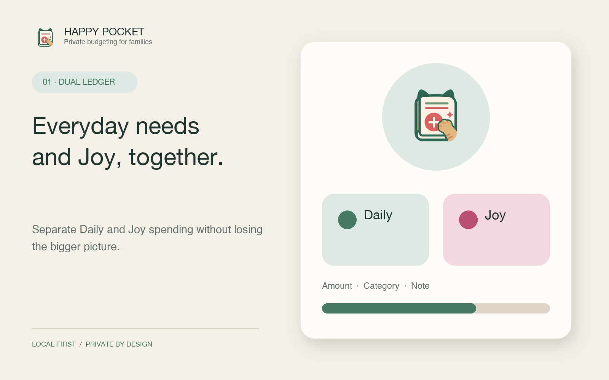
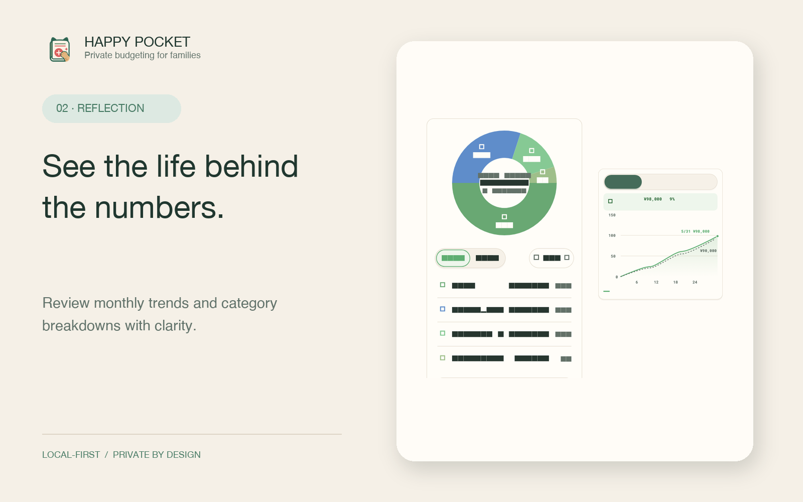
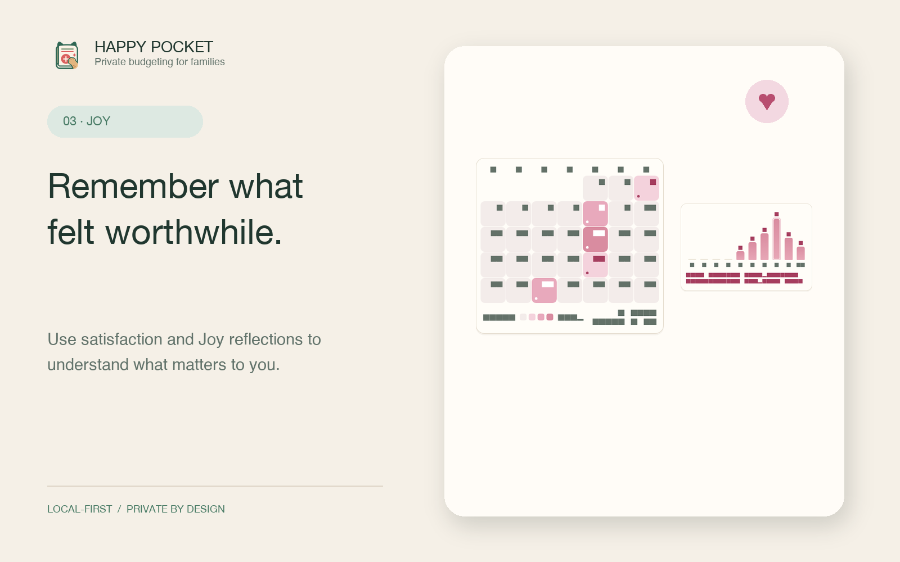
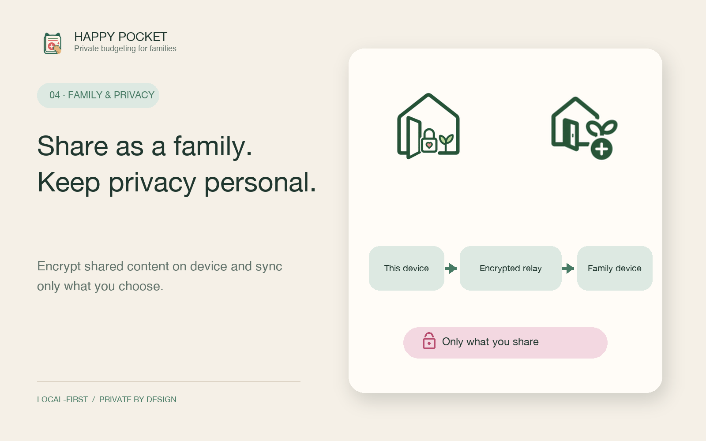
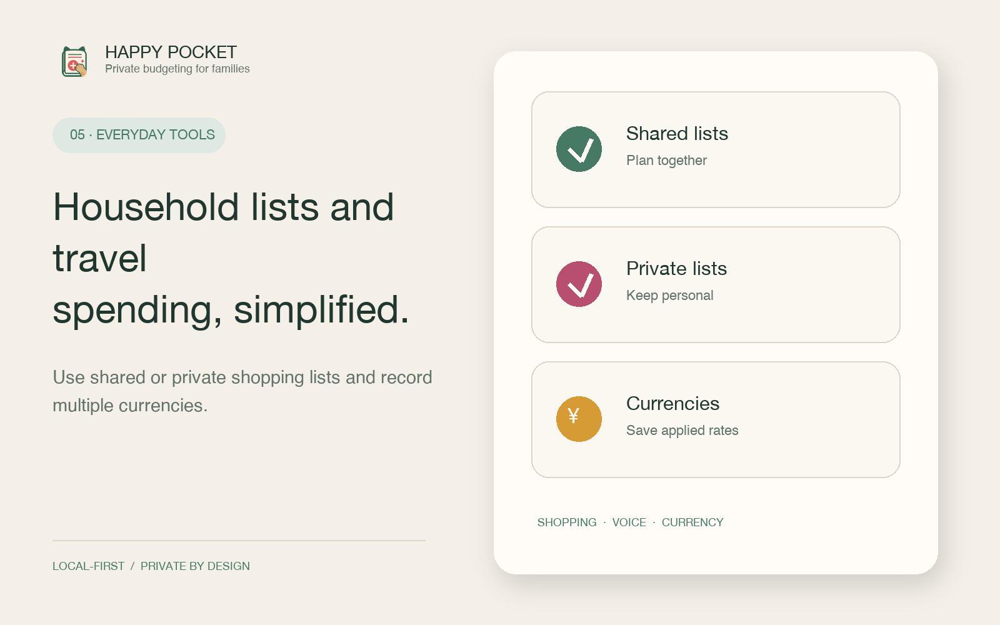

# Happy Pocket — App Introduction

## Everyday needs and Joy, together.

Happy Pocket is a local-first budgeting app designed to make room for both everyday needs and the spending that genuinely brings you Joy.

Separate expenses into Daily and Joy ledgers, then add categories, notes, and satisfaction—not just amounts. The result is a clearer view of what supports your household and what makes life feel worthwhile.

## What you can do with Happy Pocket

### 1. Keep Daily and Joy spending in view

Record groceries, bills, and other essentials in Daily, while hobbies, treats, and meaningful experiences belong in Joy. The two-ledger model helps you understand both sides of your spending without reducing every decision to restriction.

### 2. See the life behind the numbers

Clear cards show monthly spending trends and category breakdowns. Understand where spending changed and how it moved across the month without digging through a dense report.

### 3. Remember what felt worthwhile

Add a satisfaction reflection to transactions, then revisit Joy across a calendar and distribution view. Happy Pocket helps you notice patterns and make choices that feel right for you.

### 4. Share as a family while keeping private space

Create a family group with an invite code and sync selected ledgers and shopping items. Shared content is encrypted on device and delivered through a zero-knowledge relay service. Private ledgers and private shopping items stay outside the family-sharing flow.

### 5. Make everyday capture feel lighter

Use manual or voice entry when a purchase is fresh in your mind. Keep shared and private shopping lists, record spending in multiple currencies, and retain the exchange rate applied to each entry.

## Key features

| Area | Features |
|---|---|
| Budgeting | Daily / Joy dual ledgers, categories, notes, and satisfaction |
| Capture | Manual entry, voice entry, multiple currencies, saved exchange rates |
| Reflection | Monthly trends, category breakdowns, Joy calendar, satisfaction distribution |
| Family | Invite codes, selected sharing, shared and private shopping lists |
| Protection | Encrypted on-device storage, encrypted backup and restore, Face ID / passcode lock |
| Languages | Japanese, Simplified Chinese, and English |

## Privacy at the center

Budget data is encrypted when stored on your device and is not used for advertising or behavioral tracking. Network communication is still required for features such as family sync, notifications, and exchange rates. Before publication, confirm that the public privacy policy matches the production service and its retention behavior.

## Supported platforms

- iOS 15 and later
- Android 7 and later
- 日本語 / 简体中文 / English

---

**Short description**

Daily spending and personal Joy, in one private family budget. Happy Pocket helps you understand what supports everyday life and what makes it better.

**30-second introduction**

Happy Pocket is a local-first budgeting app that separates spending into Daily and Joy ledgers. Satisfaction and monthly reflection help you understand which choices felt worthwhile for you and your family. Sync only the information you choose, while private records stay on your side. Shared and private shopping lists, voice entry, multiple currencies, and encrypted backup are built in.
