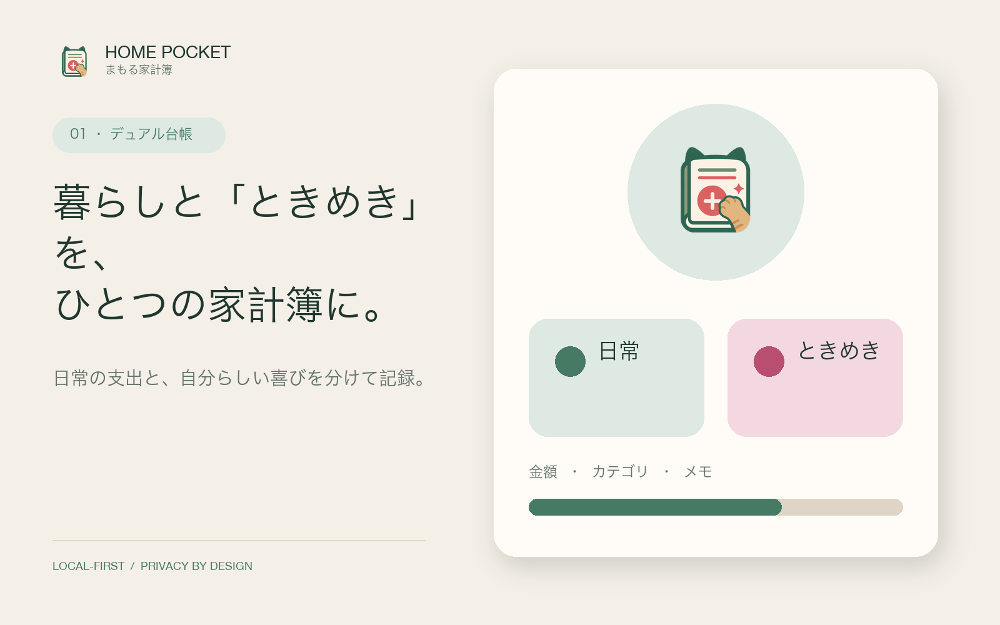
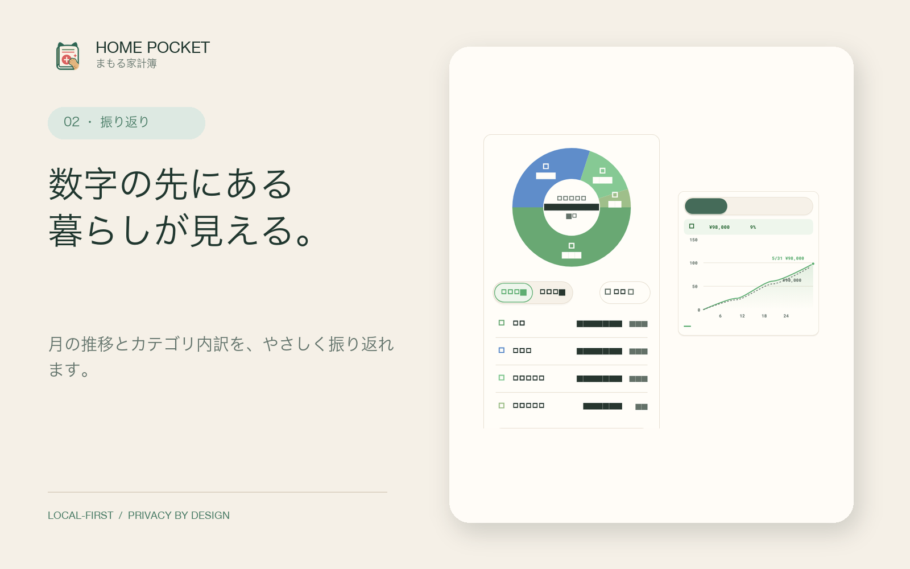
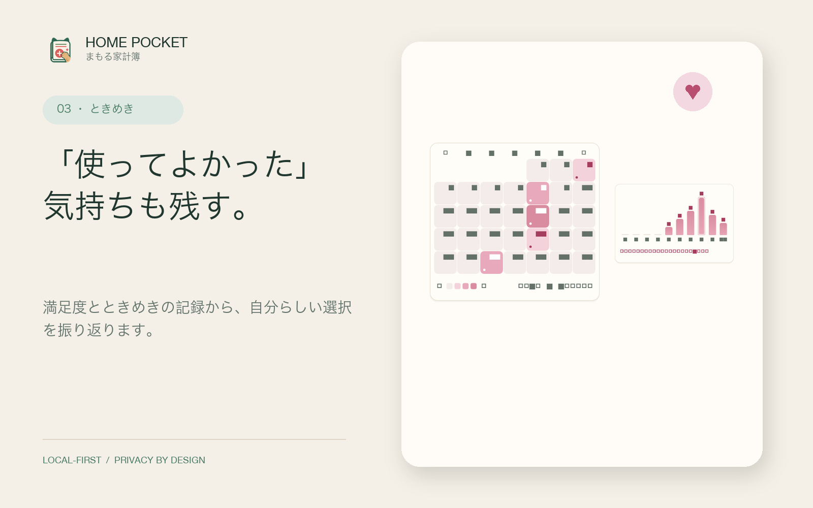
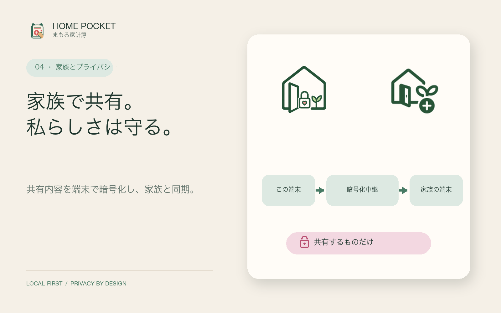
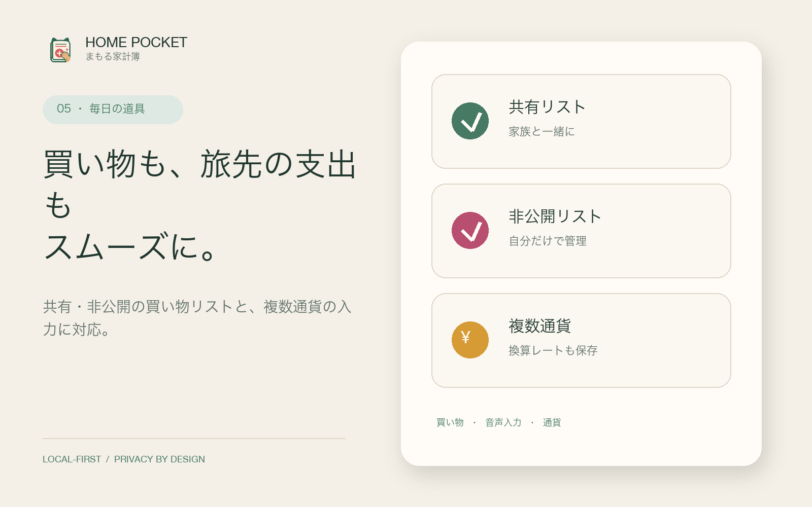

# まもる家計簿（Home Pocket）アプリ紹介

## 暮らしと「ときめき」を、ひとつの家計簿に。

まもる家計簿は、毎日の暮らしと自分らしい喜びの両方を大切にする、ローカルファーストの家計簿です。

支出を「日常」と「ときめき」の2つの台帳に分けて記録。金額だけでなく、カテゴリ、メモ、満足度も残せるので、節約のためだけではなく「何が暮らしを支え、何が自分を満たしたか」を振り返れます。

## まもる家計簿でできること

### 1. 日常と「ときめき」を分けて記録

食費や光熱費などの「日常」と、趣味や小さなご褒美などの「ときめき」を別々に記録できます。ふたつの視点を持つことで、必要な支出と、自分らしい喜びのどちらも見失いません。

### 2. 数字の先にある暮らしを振り返る

月ごとの支出推移やカテゴリ内訳を、見やすいカードで確認できます。どのカテゴリが増えたのか、月の中でどのように使ったのかを、ひと目で捉えられます。

### 3. 「使ってよかった」気持ちも残す

取引に満足度を記録し、ときめきの積み重なりをカレンダーや分布で振り返れます。単に支出を減らすのではなく、自分にとって納得できる選択を見つけるための材料になります。

### 4. 家族で共有しながら、非公開も選べる

招待コードで家族グループを作成し、共有対象の台帳や買い物項目を同期できます。共有内容は端末で暗号化され、ゼロ知識型の中継サービスを通して相手の端末へ届けられます。非公開の台帳や買い物項目は、家族共有の対象になりません。

### 5. 毎日の記録を、もっと軽やかに

手入力と音声入力に対応し、思いついたときにすばやく記録できます。共有用と自分だけの買い物リストを使い分けられるほか、複数通貨での入力と、適用した換算レートの保存にも対応しています。

## 主な機能

| 領域 | 機能 |
|---|---|
| 家計管理 | 日常 / ときめきの2つの台帳、カテゴリ、メモ、満足度 |
| 入力 | 手入力、音声入力、複数通貨、換算レートの保存 |
| 振り返り | 月ごとの推移、カテゴリ内訳、ときめきカレンダー、満足度分布 |
| 家族 | 招待コード、共有対象の同期、共有 / 非公開の買い物リスト |
| 安全性 | 端末内の暗号化保存、暗号化バックアップと復元、Face ID / パスコードロック |
| 言語 | 日本語、簡体字中国語、英語 |

## プライバシーを中心に設計

家計データは端末内で暗号化して保存します。広告や行動追跡のために家計データを利用しません。家族同期、通知、為替レート取得など、機能提供に必要な通信はあります。公開前には、実際の本番環境のデータ保持方針と一致するプライバシーポリシーをご確認ください。

## 対応プラットフォーム

- iOS 15 以降
- Android 7 以降
- 日本語 / 简体中文 / English

---

**短い紹介文**

日常の支出も、自分らしい「ときめき」も。まもる家計簿は、暮らしと喜びを一緒に見つめる、プライバシー重視の家族向け家計簿です。

**30秒紹介文**

まもる家計簿は、支出を「日常」と「ときめき」に分けて記録できるローカルファーストの家計簿です。満足度や月ごとの傾向から、自分や家族にとって納得できるお金の使い方を振り返れます。必要な情報だけを家族と同期し、非公開の記録は自分の手元に。買い物リスト、音声入力、複数通貨、暗号化バックアップにも対応しています。
